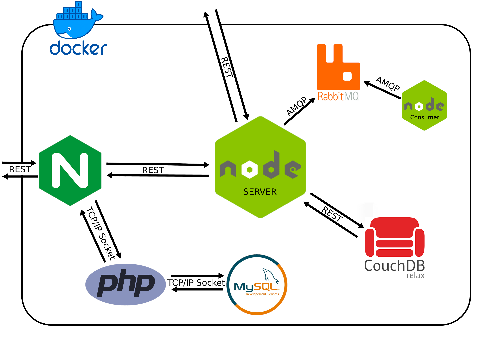
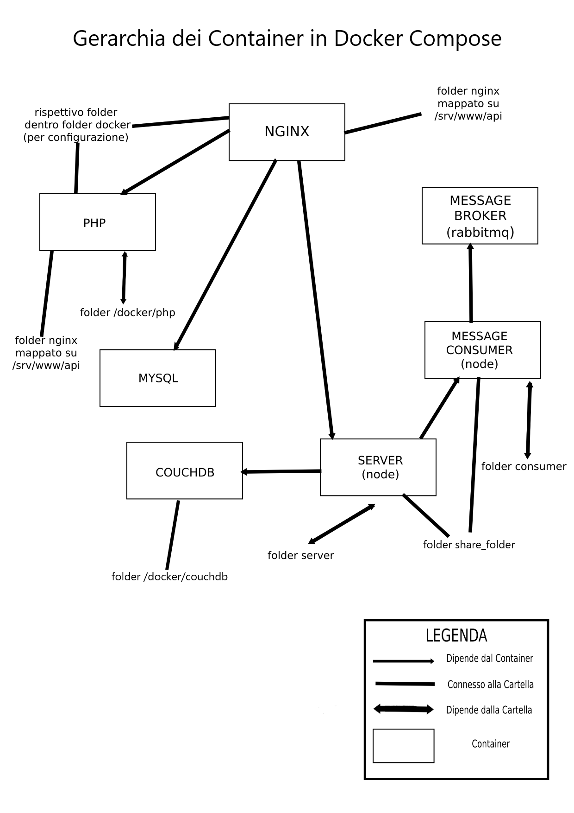

<h1>BOOKed - Info sul Progetto</h1>
<ol>
    <li>
        
<b>SCOPO  DEL PROGETTO</b>

        
BOOKed è un'applicazione che permette ad un utente di prenotare uno o più libri dandogli la possibilità di ritirarli nella biblioteca più vicina. L'applicazione utilizza una mappa interattiva con relativa interfaccia grafica. Una volta inserita la localizzazione dell'utente e tenuto conto del mezzo di trasporto che utilizzerà, vengono mostrati sulla mappa i punti di ritiro più vicini selezionabili con un clic per completare la procedura di prenotazione. Una volta prenotato il ritiro sarà possibile stampare una ricevuta in formato pdf o salvare l'avvenuta transizione sul proprio calendario google come evento (con oAuth).
        

    </li>
    <li>
        
<b>ARCHITETTURA DI RIFERIMENTO E TECNOLOGIE UTILIZZATE</b>

        
Il progetto è basato sull'idea di aggregazione di microservizi. Per raggiungere questo obiettivo abbiamo utilizzato docker (in particolare docker compose) sfruttando più container per inizializzare una serie di servizi base seperati che poi interagiscono tra loro per fornire poi il servizio finale.
            
        

    </li>
    <li>
        
<b>SODDISFACIMENTO DEI REQUISITI</b>

        

            <ol>
                <li>Vengono offerte a terze parti delle API documentate tramite APIDOC. Le API sono 3:
                    <ul>
                        <li>
                            GET /general   ==> Calcolo di distanza in linea da un'origine ad una serie di luoghi predefiniti
                        </li>
                        <li>
                            POST /specific ==> In base ad un mezzo di trasporto scelto, calcolo del tempo di percorrenza e della distanza stradale da un'origine ad una serie di luoghi predefiniti
                        </li>
                        <li>
                            GET /getLog    ==> Fornisce ad un amministratore la possibilità di visualizzare i log delle altre api
                        </li>
                    </ul>
                </li>
                <li>
                    Ci interfacciamo con API di terze parti (entrambe commerciali) e nello specifico:
                    <ul>
                        <li>Graphhopper: Geocoding API e Matrix API</li>
                        <li>Google Calendar</li>
                    </ul>
                </li>
                <li>
                    Per il servizio di oAuth viene utilizzato Google Calendar
                </li>
                <li>
                    Il progetto utilizza protocolli asincroni e in particolare AMQP e RabbitMQ per l'implentazione del logger
                </li>
            </ol>
        

    </li>
    <li>
        
<b>INSTALLAZIONE</b>

        

            Per installare l'applicazione bisogna come prima cosa scaricare l'applicazione dalla repository github.
            Finito il Download bisogna completare il file server/.env con
            <ul>
                <li>la ApiKey di Graphhopper</li>
                <li>una mail gmail e la rispettiva password per le app (<a href="https://support.google.com/accounts/answer/185833?hl=it" target=”_blank”>Tutorial per Creare Password per App</a>)</li>
            </ul>
             
            Verificare che i seguenti file abbiano i permessi di esecuzione:
            <ul>
                <li> server/server.js</li>
                <li> server/wait_for_it.sh</li>
                <li> server/initialize.sh</li>
                <li>consumer/wait_for_it.sh</li>
            </ul>
             
            Aprire un terminale nella directory principale (dove si trova il file docker-compose.yml) ed eseguire il comando: 
             
            <code>docker-compose up -d</code>
             
        

        
  
            Una volta che il comando è terminato i vari container si staranno ancora inizializzando quindi si consigli di attendere per un minuto o due, quindi si può utilizzare l'applicazione seguendo i passi indicati in "ISTRUZIONI PER I TEST"
            <b>N.B.</b>
            Poichè il certificato utilizzato per il funzionamento di ssl è self-signed potrebbe essere necessario autorizzare l'accesso sia ad nginx sia al server node.
            Per il corretto funzionamento si consiglia di visitare e autorizzare l'accesso ai segurnti link 
            <ul>
                <li><a href="https://localhost:3000/general?address=piazzale+aldo+moro+roma" target="_blank">Autorize Application Server</a> </li>
                <li><a href="https://localhost" target="_blank">Autorize Web Server</a></li>
            </ul>   
        

    </li>
    <li>
        
<b>ISTRUZIONI PER I TEST</b>

        
Per testare le funzionalità del nostro progetto è possibile:
            <ul>
                <li>
                    Accedere direttamente da web e sfruttare gli strumenti offerti dall'interfaccia grafica
                </li>
                <li>
                    Per le API: fare chiamate di test tramite la pagina di documentazione di APIDOC
                </li>
                <li>
                    Effetturare chiamate da VSCode tramite l'apposito file "testing.http"
                </li>
            </ul>
        

    </li>
</ol>

    

